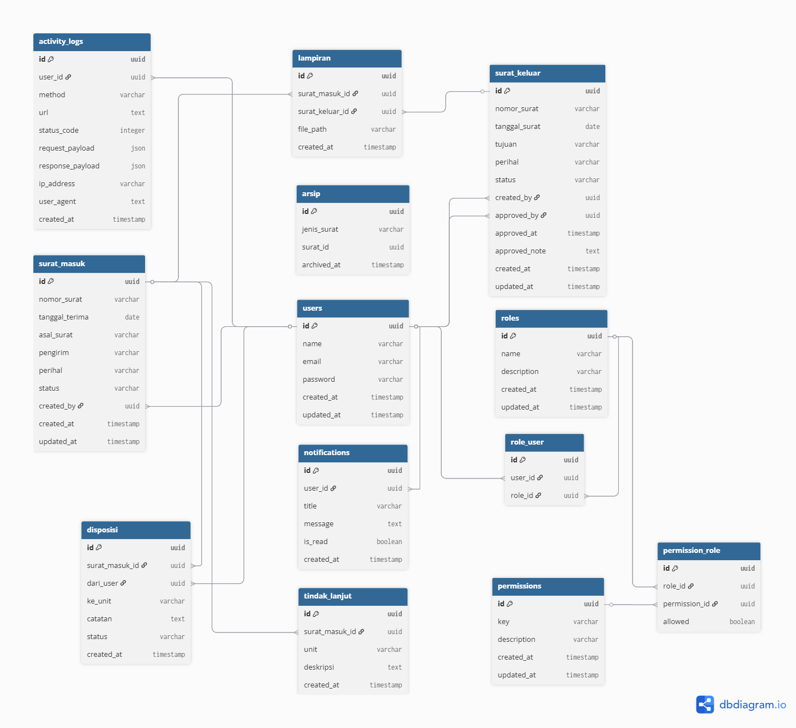

# SENTRA

<p align="center">
  
</p>

<p align="center">
  <strong>Sistem Manajemen Magang Terpadu</strong><br>
  Dibangun dengan Laravel 10 & PostgreSQL
</p>

---

## 📋 Tentang Project

**SENTRA** (_Sistem Elektronik Naskah & Arsip_) adalah aplikasi berbasis web yang dirancang untuk mendukung pengelolaan **surat masuk, surat keluar, disposisi, tindak lanjut, dan arsip digital** secara terstruktur, aman, dan terintegrasi.

Sistem ini ditujukan untuk lingkungan **instansi pemerintahan**, khususnya **Dinas Pendidikan**, dengan memperhatikan alur birokrasi, keamanan berbasis peran (role & permission), serta kebutuhan arsip jangka panjang.


### 🔥 Status Terbaru

* **Dashboard inti siap**: ringkasan mahasiswa magang, status presensi, dan logbook terkini.
* **Fitur presensi harian**: check-in & check-out dengan foto dan tanda tangan digital.
* **Logbook aktivitas**: mendukung lampiran berkas dan persetujuan oleh dosen & pembina.
* **Manajemen multi-institusi**: dukungan relasi ke entitas kampus untuk pelaporan lintas institusi.

### ✨ Fitur Utama

### 📊 Dashboard
- Ringkasan surat masuk & keluar
- Statistik dan grafik aktivitas surat
- Notifikasi surat yang perlu ditindaklanjuti

### 📥 Surat Masuk
- Input dan pencatatan surat masuk
- Verifikasi dan disposisi surat
- Tindak lanjut oleh unit kerja
- Arsip digital surat masuk

### 📤 Surat Keluar
- Pembuatan draft surat keluar
- Proses pengesahan (approval)
- Pencatatan pengiriman surat
- Arsip digital surat keluar

### 🔐 Manajemen Akses
- Role-based access control
- Permission berbasis aksi (hybrid static permission)
- Dukungan multi-role dalam satu akun pengguna

### 📂 Arsip & Laporan
- Arsip surat digital terpusat
- Pencarian surat berbasis metadata
- Laporan surat masuk & keluar

### 🔔 Notifikasi
- Notifikasi surat masuk baru
- Notifikasi surat yang membutuhkan tindak lanjut

### 🛠️ Teknologi yang Digunakan

- **Backend:** Laravel 10 (PHP ^8.1)
- **Database:** PostgreSQL / MySQL / MariaDB
- **ORM:** Eloquent
- **Authentication:** Laravel Auth
- **Authorization:** Policy & Gate (RBAC Hybrid)
- **Identifier:** UUID (digunakan pada seluruh primary & foreign key)

---

## 🚀 Instalasi

Ikuti langkah-langkah berikut untuk menjalankan project ini di local environment:

### 📋 Prasyarat

Pastikan sudah menginstal:

* PHP >= 8.1
* Composer
* Database server (PostgreSQL/MySQL/MariaDB)
* Git

### 1️⃣ Clone Repository

```bash
git clone https://github.com/onicyborg/sentra.git
cd sentra
```

### 2️⃣ Install Dependencies

```bash
composer install
```

### 3️⃣ Setup Environment

```bash
# Copy file environment
cp .env.example .env

# Generate application key
php artisan key:generate
```

### 4️⃣ Konfigurasi Database

Edit file `.env` sesuai konfigurasi database Anda:

```env
DB_CONNECTION=pgsql
DB_HOST=127.0.0.1
DB_PORT=5432
DB_DATABASE=sentra
DB_USERNAME=your_username
DB_PASSWORD=your_password
```

### 5️⃣ Buat Database

Login ke database lalu buat database baru:

```sql
CREATE DATABASE sentra;
```

### 6️⃣ Migrasi Database

```bash
php artisan migrate
```

### 7️⃣ Setup Storage Link

```bash
php artisan storage:link
```

### 8️⃣ Jalankan Aplikasi

```bash
php artisan serve
```

Aplikasi akan berjalan di `http://localhost:8000`.

---

## 📚 Dokumentasi

### Struktur Database

* `users` – Data akun pengguna
* `roles` – Role sistem
* `permissions` – Daftar permission (aksi sistem)
* `permission_role` – Relasi role & permission (allowed true/false)
* `surat_masuk` – Data surat masuk
* `surat_keluar` – Data surat keluar
* `disposisi` – Disposisi surat masuk
* `tindak_lanjut` – Tindak lanjut unit kerja
* `lampiran` – Lampiran surat
* `arsip` – Arsip digital
* `notifications` – Notifikasi sistem


### ERD



[Download ERD](./Sentra.png)

Atau impor file `database/schema.dbml` ke [dbdiagram.io](https://dbdiagram.io/) untuk melihat versi interaktif.

---

## 🤝 Kontribusi

Kontribusi sangat terbuka. Langkah umum:

1. Fork repository ini.
2. Buat branch baru: `git checkout -b feature/NamaFitur`
3. Commit perubahan: `git commit -m "feat: menambahkan fitur X"`
4. Push ke branch Anda: `git push origin feature/NamaFitur`
5. Buat Pull Request

---

## 📞 Kontak

Jika ada pertanyaan atau saran, silakan hubungi:

* **Nama:** Akhmad Fauzi
* **Email:** [akhmadfauzy40@gmail.com](mailto:akhmadfauzy40@gmail.com)
* **GitHub/LinkedIn:** [OniCyborg](https://github.com/onicyborg) | [geats](https://www.linkedin.com/in/geats/)

---

## 🙏 Acknowledgments

* [Laravel Framework](https://laravel.com)
* [PostgreSQL](https://postgresql.org)
* [MySQL](https://mysql.com)
* [MariaDB](https://mariadb.org)
* [Bootstrap](https://getbootstrap.com)
* [jQuery](https://jquery.com)
* [Font Awesome](https://fontawesome.com)
* Semua kontributor yang mendukung pengembangan SENTRA
